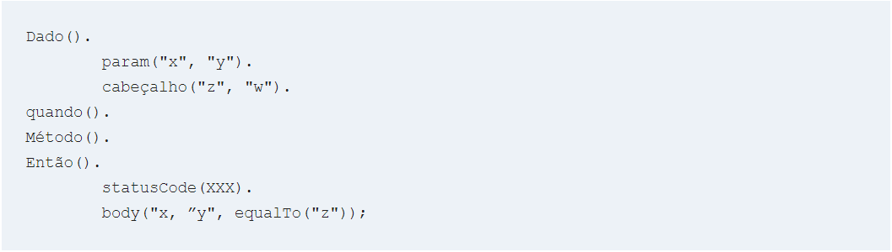
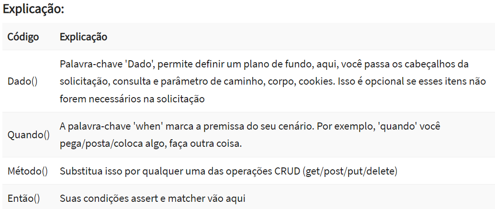

# Api rest


* Teste unitario para api Assured REST
    Syntax:
    A sintaxe do Rest Assured.io é muito parecida com o BDD
  

    ```
   

  
* JSON Schema Validation

````
    Utilizando json estática, usando DRAFTV3