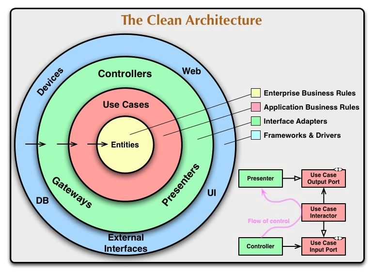
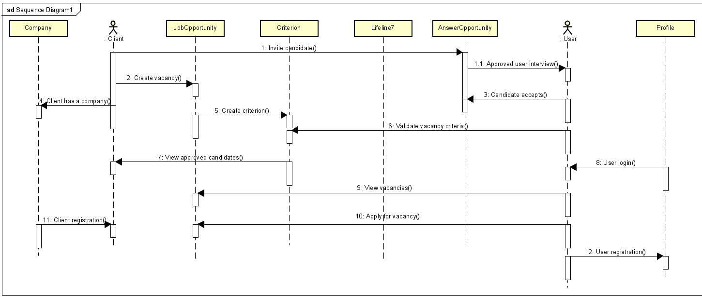
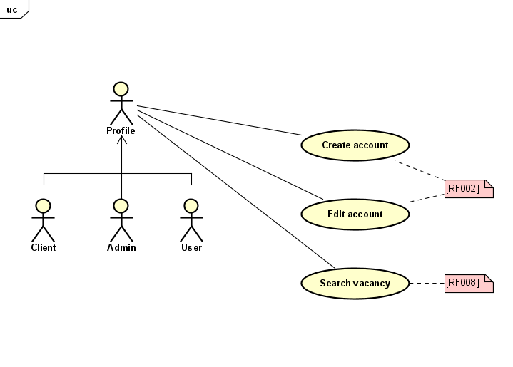
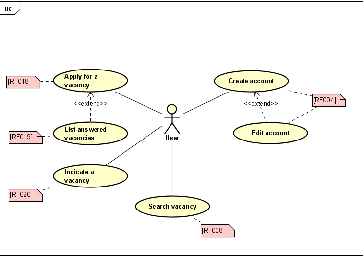
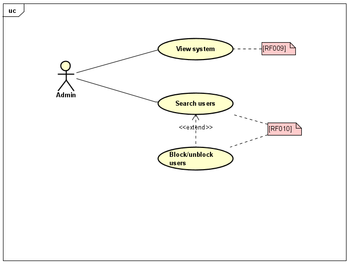
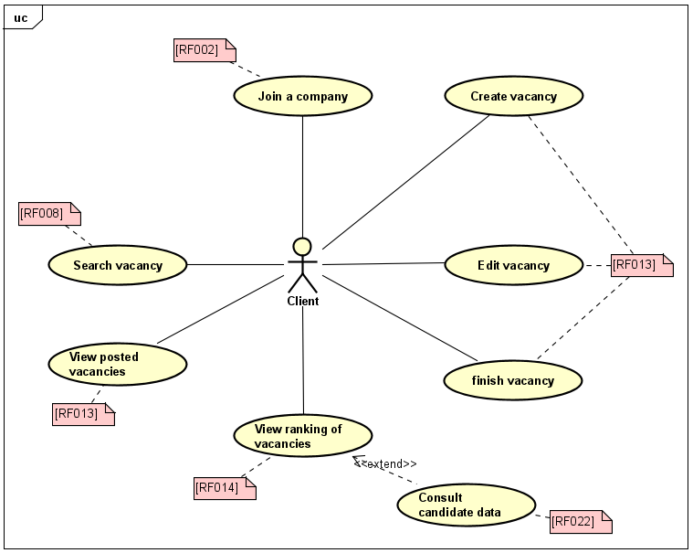
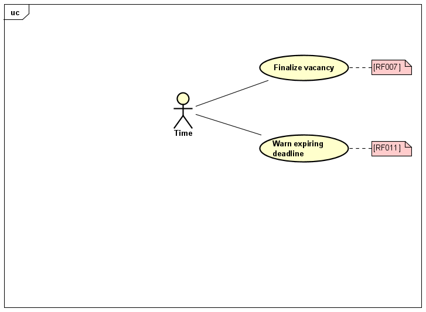

## Projeto Clean Architecture

### Introdução

Conceitos

O que é Clean Architecture?

    '''
    Arquitetura Limpa, do termo inglês Clean Architecture,  é um padrão arquitetural usado na 
    engenharia de software. Esse padrão foi conceituado por Robert Martin, mais conhecido como Uncle Bob
    Mais tarde, em 2017, ele aprofundou-se no tema em seu livro: Arquitetura Limpa: O guia do artesão para 
    estrutura e design de software
    '''
    A ideia dessa arquitetura é criar componentes fracamente acoplados que possam ser conectados através de 
    portas e adaptadores, o que permite o isolamento das regras de negócio da aplicação (ex: entidades, casos 
    de uso) de preocupações externas (ex: frameworks, banco de dados). A lógica de negócios não deve depender de 
    GraphQL ou REST por exemplo, ou se os dados estão sendo obtidos por um banco de dados ou um arquivo CSV simples. Essa separação tem, dentre outros benefícios, auxiliar na mudança de componentes e facilitar testes automatizados.
    '''

    # Uma boa arquitetura tem que ter 
     - Os casos de uso e operação do sistema
     - A manutenção do sistema
     - O desenvolvimento do sistema
     - A implantação do sistema

    E afinal o que é arquitetura
    '''
    A arquitetura de um sistema de software é a forma dada a esse sistema pelos seus criadores. Essa forma está
    na divisão desses sistemas em componentes, na organização desses componentes e nos modos de como esses componentes
    se comunicam entre si.
    '''
    O proposito dessa forma é facilitar o desenvolvimento, implantação, operação e manutenção do sistema de software
    contido nela.
    '''
    A estretégia por trás dessa facilitação é deixar o máximo possivel de opções abertas, pelo maximo de tempo possivel
    '''
    
    # Mantendo as opções abertas
    '''
    Todos os sistemas de software podem ser decompostos em dois elementos principais: politica e detalhes.
    O elemento politico engloba toda as regras e procedimentos de negocios
    O elemento detalhes engloba todos os detalhes do sistema, como: banco de dados, arquivos, frameworks, entre outros..
    '''

## Sobre o projeto

Documento de Visão

Introdução O RH 2.0 ganhou protagonismo e está sendo promovido a área estratégica, essencial para a 
tomada de decisão e crescimento do negócio. Problemas antigos como a dificuldade em medir o retorno 
sobre o investimento (ROI) das ações, ineficiência do recrutamento e baixo desempenho em treinamentos 
já têm suas soluções tecnológicas sob medida. As HRTechs são startups que desenvolvem soluções tecnológicas 
para a área de Recursos Humanos (Human Resources), agregando inteligência aos processos. A missão dessas 
empresas é levar a inovação ao RH, mostrando que a tecnologia pode reduzir custos, aumentar a eficiência e 
agilizar o crescimento do setor.

Cenário Atual VenturaSoft é uma HRTech que atua no segmento de recolocação de profissionais de TI. Devido 
às peculiaridades desse mercado, os requisitos para contratação têm um dinamismo vertiginoso, pois as 
tecnologias e as “stacks” adotadas pelas empresas estão em constante evolução. A empresa necessita que seja 
construída uma solução de software, chamado de VenturaHR, que tenha abrangência de todos os fluxos operacionais 
da sua atividade fim. A VenturaSoft tem como clientes empresas que precisam fazer processos seletivos para vagas 
em aberto.

Solução Desejada O software VenturaHR precisa ter como diferencial o fato de não manter um banco de curriculums 
e sim um banco de Vagas X Critérios X Candidatos.

* Diagrama sequencial

* Caso de uso

    - Profile
  
    - User
  
    - Admin
  
    - Client
  
    - Time
  

      
